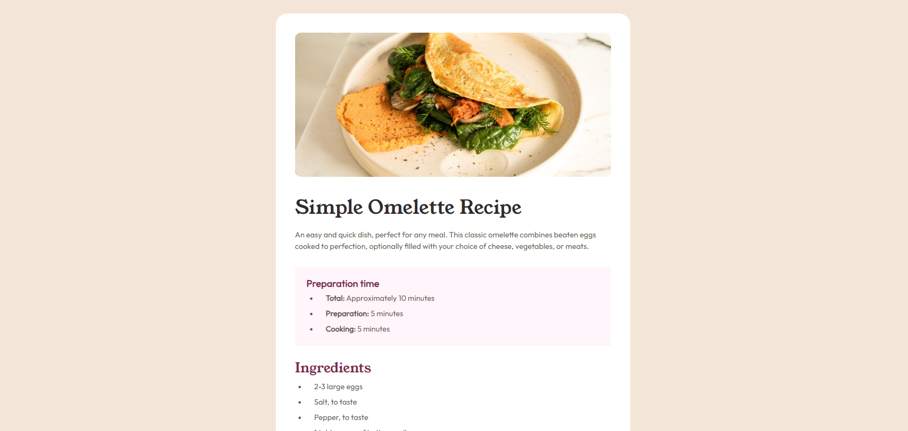

## Table of contents

- [Overview](#overview)
  - [Screenshot](#screenshot)
- [My process](#my-process)
  - [Built with](#built-with)
  - [What I learned](#what-i-learned)
  - [Continued development](#continued-development)
- [Author](#author)

### Screenshot

### Links

- Solution URL: [Github solution](https://github.com/i-prkr/recipe-page)
- Live Site URL: [Recipe page live site](https://i-prkr.github.io/recipe-page/)

### Built with

- Semantic HTML5 markup
- CSS custom properties
- Flexbox
- Mobile-first workflow

### What I learned

Practising developing using a mobile first workflow and media queries. It was very helpful in considering and understanding how best to carry out development for a solution that is responsive, by building from the most minimal design outwards.

### Continued development

I would like to continue to practice using media queries and working on how I approach building out designs.

## Author

- Frontend Mentor - [@i-prkr](https://www.frontendmentor.io/profile/i-prkr)
